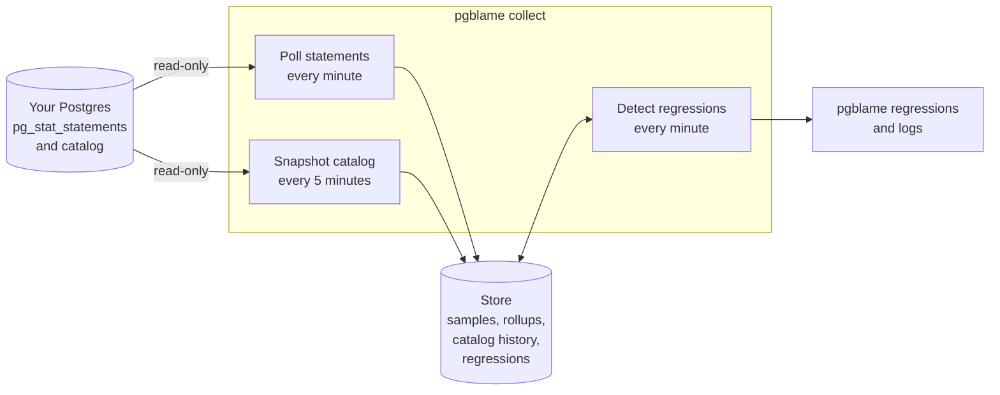

# pgblame

[](https://github.com/BloodShotAK/pgblame/actions/workflows/ci.yml)
[](LICENSE)
[](#usage)

**`git blame` for slow Postgres queries.**

pgblame notices when a query gets slower than it normally is, and helps you
find out what changed: a dropped index, a planner setting, or shifted
statistics.

```
$ pgblame regressions
as of 2026-09-26 18:07:33: 1 regressed, 6 healthy, 2 with too little traffic to judge

  extra/hour  baseline ms  now ms  ratio  calls       kind  query
     13.919s        0.017   0.206  12.2x   2759  more_work  SELECT abalance FROM pgbench_accounts WHERE aid = $1
```

## Why

Queries often slow down when nothing in the application changed. A
migration dropped an index, autovacuum re-analyzed a table, or someone
changed a setting, and the planner switched plans. `pg_stat_statements`
only keeps running totals and the catalog only shows the present, so these
regressions are usually found by users first and diagnosed by hand.

## Features

- Detects regressions against each query's own history, accounting for
  time of day and day of week, and ranks them by the extra database time
  they cost.
- Labels each regression: plan change, more rows, cache misses, or
  contention.
- Records index, setting, statistics and table-size changes as a history.
- Counts correctly through `pg_stat_statements` resets and evictions.
- Works with any Postgres 14+, self-hosted or managed, using only
  `pg_stat_statements` and the built-in `pg_monitor` role.
- Read-only and lightweight on the database it watches.
- A single static binary.

## Architecture



The collector writes everything to a store database you host, so the
monitored server gets no pgblame tables.

## Quickstart

This starts a Postgres under load, a store, and the collector:

```sh
docker compose up -d --build
make check
make logs
```

Then break something and watch it get flagged:

```sh
docker compose exec target psql -U postgres -d app \
  -c "ALTER SYSTEM SET enable_indexscan = off" \
  -c "ALTER SYSTEM SET enable_bitmapscan = off" \
  -c "SELECT pg_reload_conf()"
make regressions
```

## Usage

1. Add `pg_stat_statements` to `shared_preload_libraries` and restart. On
   managed Postgres, set it through the provider's parameter settings.
2. Run [`deploy/target/setup.sql`](deploy/target/setup.sql) to create the
   extension and a `pgblame` role with `pg_monitor`.
3. Optionally, run [`deploy/target/helper.sql`](deploy/target/helper.sql)
   in each database so pgblame can read column statistics for every table.
4. Check the server, then start collecting:

```sh
pgblame check   --target-dsn "postgres://pgblame@db:5432/app?sslmode=verify-full"
pgblame collect --target-dsn "postgres://pgblame@db:5432/app?sslmode=verify-full" \
                --store-dsn  "postgres://pgblame@store:5432/pgblame"
pgblame regressions --store-dsn "postgres://pgblame@store:5432/pgblame"
```

`check` lists everything that's missing, with the fix for each. DSNs can
also be set with `PGBLAME_TARGET_DSN` and `PGBLAME_STORE_DSN`.

## How detection works

Every minute, each query's latency over the last 15 minutes is compared
with the same hour in previous weeks, or with the last day when there isn't
enough history. A query is flagged when it is at least 1.5× slower, well
outside its normal variation, and costing at least a second of extra
database time per hour. The regression closes once the query recovers.

| Kind | What changed | Usually means |
|---|---|---|
| `more_work` | Same rows, far more blocks read | The plan changed |
| `more_rows` | More rows per call | The data or parameters changed |
| `cache_misses` | More blocks read from disk | The working set outgrew memory |
| `slower_same_work` | Nothing measurable | Contention, locks or I/O |

## Resource usage

- Read-only sessions, at most two connections, each with a 10s statement
  timeout and a 1s lock timeout, so pgblame gives up rather than wait on
  your workload.
- Each cycle's cost grows with the number of distinct queries and tables,
  not with the amount of data. Column statistics are re-read only for
  tables analyzed since the last cycle.
- The store keeps per-minute samples for 3 days and hourly rollups for
  35 days, so it stays bounded.

To see the cost on your own hardware, `make overhead` builds a large test
database and times each read.

## Security

pgblame never writes to the database it watches, and it redacts passwords
from query texts before storing them. See [SECURITY.md](SECURITY.md).

## Development

```sh
make test               # unit tests
make test-integration   # against the local Postgres in compose
make harness            # detection accuracy against injected faults
```

## License

[Apache License 2.0](LICENSE).
